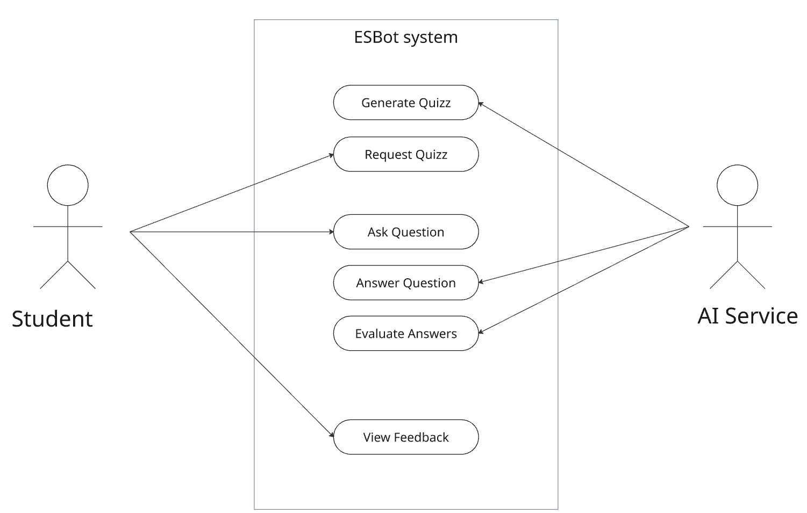

# Use Case: Request Quiz

### Name:
Request Quiz

### Summary:
The student requests a quiz on a specific topic to test their understanding. The system processes the request and generates appropriate quiz questions using an AI service.

### Actor:
Student

### Triggering Event:
The student asks ESBot to generate a quiz for a specific topic.

### Inputs:
- Topic or subject area

### Pre-Conditions:
- The user is actively using the system  
- The system is available  
- AI service is accessible  

### Process Description:
1. The student requests a quiz for a given topic  
2. The system processes the request  
3. The system calls the AI service to generate quiz questions  
4. The system receives the generated quiz  
5. The quiz is displayed to the student  

### Exceptions:
- AI service is unavailable → system shows fallback message

### Outputs and Post-Conditions:
- Quiz questions are displayed  
- Interaction is stored in the session history  

# Use Case: Generate Quiz

### Name:
Generate Quiz

### Summary:
The system generates a set of quiz questions based on a given topic using an AI service.

### Actor:
- System (ESBot) 
- AI Service

### Triggering Event:
Triggered by the "Request Quiz" use case.

### Inputs:
- Topic  
- Context

### Pre-Conditions:
- Valid topic is provided  
- AI service is reachable  

### Process Description:
1. System creates a prompt with topic and context  
2. Prompt is sent to AI service  
3. AI generates quiz questions  
4. System receives and processes the output  

### Exceptions:
- AI returns invalid or unusable output → system regenerates or formats output  
- AI service timeout → fallback response  

### Outputs and Post-Conditions:
- Structured quiz questions are returned to the system  

# Use Case: Answer Questions

### Name:
Answer Questions

### Summary:
The student answers the generated quiz questions to test their knowledge.

### Actor:
Student

### Triggering Event:
The student submits answers to quiz questions.

### Inputs:
- User answers  

### Pre-Conditions:
- A quiz has been generated  
- Questions are displayed to the user  

### Process Description:
1. Student reviews quiz questions  
2. Student enters answers  
3. Student submits answers to the system  

### Exceptions:
- Incomplete answers → system prompts user to complete  
- Invalid input format → system requests correction  

### Outputs and Post-Conditions:
- Answers are submitted and stored  
- System proceeds to evaluation  

# Use Case: Evaluate Answers

### Name:
Evaluate Answers

### Summary:
The system evaluates the user’s answers and determines correctness, providing feedback using AI support.

### Actor:
- System (ESBot) 
- AI Service

### Triggering Event:
Triggered after the user submits answers.

### Inputs:
- User answers  
- Original quiz questions  

### Pre-Conditions:
- Answers have been submitted  
- AI service is available  

### Process Description:
1. System sends answers and questions to AI  
2. AI evaluates correctness  
3. AI generates feedback  
4. System processes and formats feedback  

### Exceptions:
- AI unavailable → system provides basic or generic feedback  
- AI output unclear → system retries or simplifies result  

### Outputs and Post-Conditions:
- Evaluation results are generated  
- Feedback is ready for display  

# Use Case: View Feedback

### Name:
View Feedback

### Summary:
The student views the evaluation results and feedback for their submitted answers.

### Actor:
Student

### Triggering Event:
The system presents feedback after evaluation.

### Inputs:
- Evaluation results  
- Feedback data  

### Pre-Conditions:
- Answers have been evaluated  

### Process Description:
1. System displays feedback to the student  
2. Student reviews correctness and suggestions  
3. Student may decide to retry or continue learning  

### Exceptions:
- Feedback not available → system informs user  

### Outputs and Post-Conditions:
- Student receives feedback  
- Learning progress is updated

*Info: GitHub Copilot used to refine sentences*