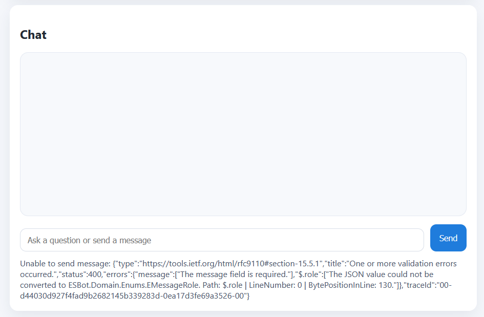

# ESBot Test Report

## Test Case 1: TC-AUTH-01 - User Registration and Session Creation

### Test Case Details
- **Test Case ID**: TC-AUTH-01
- **Date**: 2026-06-23
- **Tester Name**: Konrad
- **Environment**:
  - OS: Windows 11
  - Browser: Firefox
  - LLM Mock: Not applicable for this test

### Test Steps Performed

| Step | Action | Expected Result |
|------|--------|-----------------|
| 1 | Open browser and navigate to http://localhost:3000 | UI renders correctly with "API Configuration", "User Creation", and "Session Management" sections visible |
| 2 | Click "Ping API" button with default URL (http://localhost:5243) | Status shows "API is reachable." message |
| 3 | Fill in User Creation form: username="testuser123", email="test@example.com", password="TestPassword123" | Form fields accept input without errors |
| 4 | Click "Create User" button | Success message displayed, currentUser object populated |
| 5 | Enter valid session name in "Create Session" input field | Input field accepts value |
| 6 | Click "Create Session" button | New session appears in "Available Sessions" dropdown list |
| 7 | Select created session from dropdown | Session selected, chat panel becomes visible |
| 8 | Verify session is shown in "Current Session" display | Session name displayed correctly |

### Expected vs. Actual Result

| Aspect | Expected | Actual | Status |
|--------|----------|--------|--------|
| Backend Health Check | HTTP 200 response from `/api/v1/health` | Endpoint reachable | PASS |
| Frontend Rendering | All UI components render without JavaScript errors | UI loads successfully | PASS |
| API Connectivity | Frontend successfully pings backend at correct endpoint | Ping succeeds | PASS |
| User Creation | New user created and stored in database, returns userId | User created with valid ID | PASS |
| Session Creation | New session created for user, appears in dropdown | Session created and listed | PASS |
| Session Selection | Chat panel becomes visible after session selection | Chat interface displays | PASS |

### Result
**PASS**

---

## Test Case 2: TC-CHAT-02 - Ask Question and Receive AI Response

### Test Case Details
- **Test Case ID**: TC-CHAT-02
- **Date**: 2026-06-23
- **Tester Name**: Konrad
- **Environment**:
  - OS: Windows 11
  - Browser: Firefox

### Test Steps Performed

| Step | Action | Expected Result |
|------|--------|-----------------|
| 1 | Ensure TC-AUTH-01 is completed (user created, session selected) | User and session context available |
| 2 | Verify chat panel is visible with message input field | Chat interface fully loaded |
| 3 | Click message input field | Cursor visible in input, field is active |
| 4 | Type question: "What is polymorphism in object-oriented programming?" | Text appears in input field without character limit issues |
| 5 | Press Enter or click Send button | Message submitted to backend API POST /v1/message endpoint |
| 6 | Observe message appears in chat as "User" message | User message shown on right side with blue background |
| 7 | Wait for backend to process and call LLM mock | Backend receives question, calls mocked LLM service |
| 8 | Backend receives mocked response: "Polymorphism means one thing can have different forms or behaviors." | Mocked LLM response generated |
| 9 | Observe bot response appears in chat | Bot message shown on left side with white background and border |
| 10 | Verify message appears with timestamp | Both user and bot messages include timestamps |
| 11 | Scroll message history if necessary | Previous messages remain visible |

### Expected vs. Actual Result

| Aspect | Expected | Actual | Status |
|--------|----------|--------|--------|
| Message Input Field | Accepts text input and displays typed message | Field accepts input | PASS |
| Send Message | Message sent successfully to backend API | POST request fails with 400 Bad Request | FAIL |
| User Message Display | Message appears in chat bubble on right | Message is not displayed | FAIL |
| LLM Processing | Backend calls mocked LLM service and receives response | skipped | - |
| Bot Message Display | Bot response appears in chat bubble on left (white/border) | skipped | - |
| Message History | All messages persist in conversation | skipped | - |
| Message Formatting | Messages properly escaped and formatted | skipped | - |

### Screenshots

### Result
**FAIL**

---

## Reflection
Manual test execution proved tedious and repetitive, which increased tester fatigue and made simple mistakes more likely.
The overall process was relatively slow and inefficient.
Automating repetitive setup steps and streamlining test data management could somewhat reduce human error and speed up execution.

*Info: Github Copilot used to improve writing*
